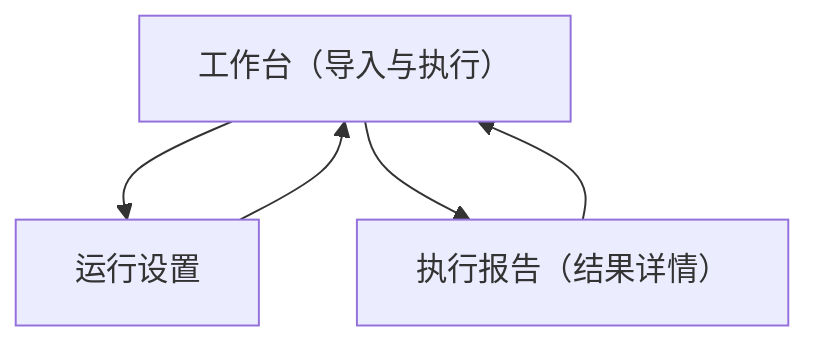

## 1. Product Overview
“测试用例执行GUI工具”用于从 Markdown 测试计划中识别测试用例，加载为可操作列表，并支持单条/批量执行与结果展示。
面向测试工程师/开发者，提升用例执行效率与可追溯性。

## 2. Core Features

### 2.1 Feature Module
本工具需求包含以下主要页面：
1. **工作台（导入与执行）**：导入Markdown、用例解析与列表、筛选与选择、单条/批量执行、进度与结果概览。
2. **执行报告（结果详情）**：查看本次/历史执行报告、用例级详情（状态/耗时/错误）、日志与导出。
3. **运行设置**：配置执行方式（命令/脚本）、工作目录、超时与并发、报告输出策略。

### 2.3 Page Details
| Page Name | Module Name | Feature description |
|-----------|-------------|---------------------|
| 工作台（导入与执行） | Markdown导入 | 选择本地Markdown文件并加载；显示文件路径与最近导入记录；导入失败时提示原因（无法读取/格式不支持）。 |
| 工作台（导入与执行） | 用例识别与解析 | 从Markdown中解析用例（用例ID/标题/步骤/预期）；当字段缺失时标记“信息不完整”；解析后生成用例数量统计。 |
| 工作台（导入与执行） | 用例列表与筛选 | 展示用例表格（勾选、ID、标题、标签/分组、状态）；支持关键字搜索与按分组过滤；支持全选/反选。 |
| 工作台（导入与执行） | 执行控制（单条/批量） | 对选中用例执行“运行/停止”；支持单条从行内操作触发；批量执行按队列推进并显示当前执行项；停止后将未执行项标记为“已取消”。 |
| 工作台（导入与执行） | 进度与结果概览 | 实时展示总体进度（已完成/总数）、通过/失败/跳过计数；列表中用例状态实时更新；支持点击某条用例打开右侧详情抽屉（步骤、预期、运行输出摘要）。 |
| 执行报告（结果详情） | 报告列表 | 展示历史执行记录（时间、用例总数、通过率、耗时）；支持打开某次报告。 |
| 执行报告（结果详情） | 报告详情 | 展示本次执行的汇总指标与用例结果表；支持按状态筛选；查看用例级详细输出（标准输出/错误、失败原因）。 |
| 执行报告（结果详情） | 导出 | 将报告导出为文件（如Markdown/JSON）；导出包含汇总与用例级结果明细。 |
| 运行设置 | 执行器配置 | 配置执行命令/脚本模板（可引用用例ID等变量）；配置工作目录；保存并在工作台执行时生效。 |
| 运行设置 | 运行策略 | 设置超时、并发数（默认1）、失败是否继续；校验配置合法性并提示。 |

## 3. Core Process
- 核心流程（导入→执行→查看结果）：你在工作台选择并导入Markdown测试计划；工具解析并生成用例列表；你通过筛选与勾选确定要执行的用例；你选择单条运行或批量运行；执行过程中工具持续更新进度与各用例状态；执行完成后你可进入“执行报告”查看详情并导出。
- 设置流程（首次使用/变更环境）：你进入运行设置配置执行命令、工作目录、超时与并发；保存后返回工作台执行。

