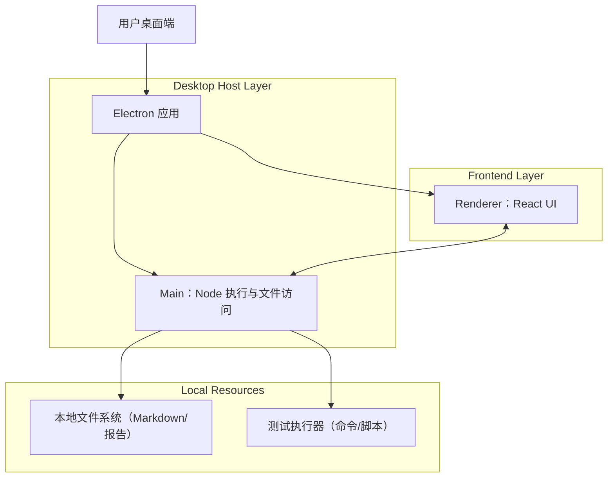

## 1.Architecture design


## 2.Technology Description
- Frontend: React@18 + TypeScript + vite + tailwindcss@3 + React Router
- Backend: Electron Main Process（Node.js）+ IPC（进程间通信）
- Storage: 本地文件（报告导出）+ 本地配置（JSON/应用配置存储）

## 3.Route definitions
| Route | Purpose |
|-------|---------|
| / | 工作台：导入Markdown、用例列表、执行与结果概览 |
| /reports | 执行报告：历史列表与报告详情 |
| /settings | 运行设置：执行命令、工作目录、超时与并发 |

## 4.API definitions (If it includes backend services)
本产品无HTTP后端服务；使用 Electron IPC 作为“内部API”。

### 4.1 IPC 通道（核心）
TypeScript 类型（Renderer 与 Main 共享）：
```ts
export type TestCase = {
  id: string;
  title: string;
  steps?: string;
  expected?: string;
  tags?: string[];
  group?: string;
};

export type CaseResultStatus = 'passed' | 'failed' | 'skipped' | 'running' | 'canceled';

export type CaseResult = {
  caseId: string;
  status: CaseResultStatus;
  durationMs?: number;
  stdout?: string;
  stderr?: string;
  errorMessage?: string;
};

export type RunConfig = {
  commandTemplate: string; // 如："npm test -- --caseId={caseId}"
  cwd?: string;
  timeoutMs?: number;
  concurrency?: number;
  continueOnFail?: boolean;
};

export type RunSummary = {
  runId: string;
  startedAt: string;
  finishedAt?: string;
  total: number;
  passed: number;
  failed: number;
  skipped: number;
  canceled: number;
  durationMs?: number;
};
```

- `ipc:importMarkdown`：读取本地Markdown并解析为 `TestCase[]`
- `ipc:runCases`：传入 `caseIds: string[]` + `RunConfig`，返回 `runId`
- `ipc:stopRun`：停止当前执行队列（按 runId）
- `ipc:runProgress`（事件）：推送 `RunSummary` 与增量 `CaseResult`
- `ipc:listReports`：列出历史报告元数据
- `ipc:getReport`：读取报告详情（summary + results）
- `ipc:exportReport`：导出报告为文件（Markdown/JSON）
- `ipc:getSettings` / `ipc:saveSettings`

## 5.Server architecture diagram (If it includes backend services)
（无独立服务端；Main 进程承担文件访问与命令执行。）

## 6.Data model(if applicable)
### 6.1 Data model definition
- Settings：运行配置（`RunConfig`）与最近导入文件路径列表
- Report：`RunSummary` + `CaseResult[]`（按 runId/时间戳存储为本地文件，供历史查看与导出）
